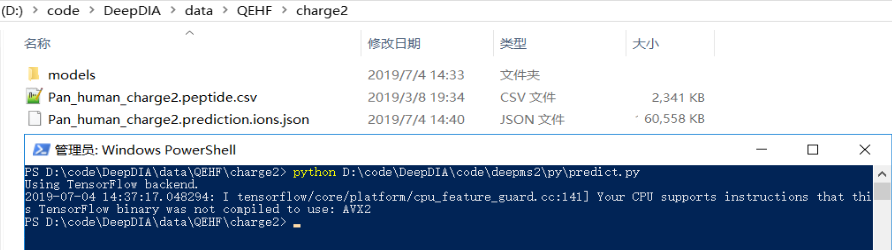
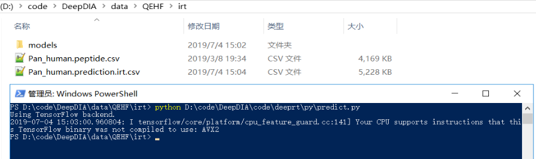
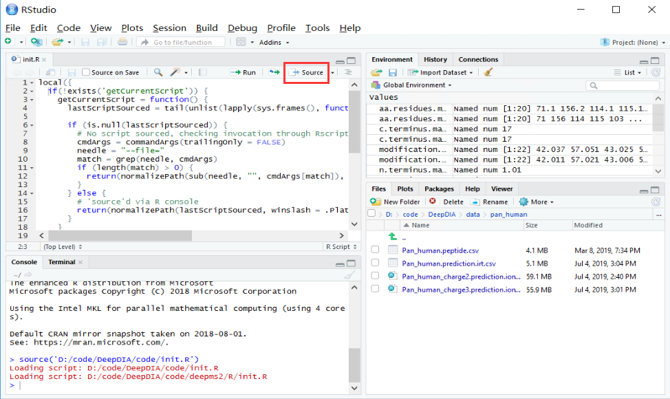
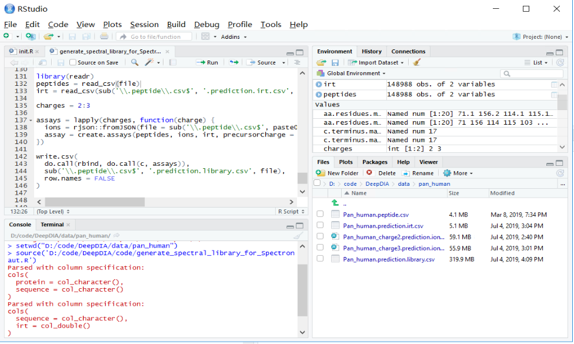

# DeepDIA Demo: Spectral Library Generation From Peptide Lists
Using deep learning to generate in silico spectral libraries from peptide lists for data-independent acquisition (DIA) analysis. 

## 1. System Requirements
In this demo, spectral library generation has been tested on a workstation with Intel Xeon E5-2690 v3 CPU, 16 GB RAM, and Microsoft Windows Server 2016 Version 1607 (OS Build 14393.2430) operating system with the following softwares:
- Anaconda 4.2.0 (Python 3.5.2).
- Keras 2.2.4 and TensorFlow 1.11.
- Microsoft R Open 3.5.1.
- RStudio 1.1.447.
- R pakages `rjson` and `readr`.

DIA data analysis is performed on a workstation with Intel Core i9-7960X CPU, 128 GB RAM, and Microsoft Windows 10 Version 1809 (OS Build 17763.503) 64-bit operating system with the following softwares:
- Spectronaut 12.0.20491.

## 2. Demo Data
LC-MS/MS data of 3 DIA technical replicates of 2 h gradient of HeLa cells on Q Exactive HF are available at ProteomeXchange (http://proteomecentral.proteomexchange.org/) with the data set `PXD005573`. (Bruderer, R. et al. Mol. Cell. Proteomics 2017, 16, 2296-2309.)
- Fig1_MP-DIA-120min120kMS1-22W30k-8dppp_MHRM_R01.raw
- Fig1_MP-DIA-120min120kMS1-22W30k-8dppp_MHRM_R02.raw
- Fig1_MP-DIA-120min120kMS1-22W30k-8dppp_MHRM_R03.raw

SwissProt *Homo sapiens* database (FASTA) can be downloaded from UniProt (https://www.uniprot.org/). The FASTA file (2018-04 version, 20,301 entries)
has been deposited to ProteomeXchange via the iProX partner repository with the data set identifier `PXD014108/IPX0001628000`. 
- swissprot_human_201804_validated.fasta

Pre-trained models for Q Exactive HF trained with HeLa data from `PXD005573` are available at ProteomeXchange/iProX with identifier `PXD014108/IPX0001628000`.
- HeLa.model.zip

They are also provided in `data/models` folder.

Peptide lists (CSV) collected from the Pan Human Library (Rosenberger, G. et al. Sci. Data 2014, 1, 140031) are provided in `data/peptides` folder.
- Pan_human.peptide.csv
- Pan_human_charge2.peptide.csv
- Pan_human_charge3.peptide.csv

Generated spectral libraries and the saved projects from Spectronaut are also available at ProteomeXchange/iProX with identifier `PXD014108/IPX0001628000`.
- Pan_human_prediction.library.zip
- Pan_human_prediction.kit
- HeLa_Pan_prediction.sne.zip
- HeLa_Pan_prediction.csv.zip

## 3. Spectral Library Generation

### 3.1. Prepare Peptide Lists
A peptide list is stored in a comma-separated values (CSV) file including a column named `sequence`.  
DeepDIA only supports peptide sequences with standard amino acids (ACDEFGHIKLMNPQRSTVWY) and length <= 50.

In this demo, the peptide list files are provided in `data/peptides` folder.

### 3.2. Predict MS/MS Spectra
In this demo, pre-trained models `data/model/charge2` and `data/model/charge3` are used for MS/MS prediction.

Copy the peptide list file `data/peptides/Pan_human_charge2.peptide.csv` to the model directory.
Run `deepms2/py/predict.py` in the directory.
```
cd {PATH_TO_MODEL}
python {PATH_TO_CODE}/deepms2/py/predict.py
```
Expected run time depends on the number of peptides and the performance of the computer. In this demo, this command may take about 5 min.



Predict MS/MS spectra for charge 3+ following the same steps.

### 3.3. Predict iRT
In this demo, a pre-trained model `data/model/irt` is used for iRT prediction.

Copy the peptide list file `data/peptides/Pan_human.peptide.csv` to the model directory.
Run `deeprt/py/predict.py` in the directory.
```
cd {PATH_TO_MODEL}
python {PATH_TO_CODE}/deeprt/py/predict.py
```

Expected run time depends on the number of peptides and the performance of the computer. In this demo, this command may take about 2 min.



### 3.4. Generate Spectral Library
Move the predicted MS/MS and iRT files to the same directory with the peptide list.
- Pan_human.peptide.csv
- Pan_human_charge2.prediction.ions.json
- Pan_human_charge3.prediction.ions.json
- Pan_human.prediction.irt.csv

Start RStudio, ensure packages `readr` and `rjson` have been installed.
```
install.packages("readr")
install.packages("rjson")
```

Open `init.R` and run the script by clicking `Source`.
```
source("{PATH_TO_CODE}/init.R")
```



Set the peptide list directory as working directory and run `generate_spectral_library_for_Spectronaut.R`.
```
setwd("{PATH_TO_DATA}")
source("{PATH_TO_CODE}/generate_spectral_library_for_Spectronaut.R")
```

Expected run time depends on the number of peptides and the performance of the computer. In this demo, this command may take up to 1 h.



The output library file can be imported into Spectronaut.
-  Pan_human.prediction.library.csv


## 4. DIA Data Analysis
### 4.1. Import the Spectral Library
Open Spectronaut, import library `Pan_human.prediction.library.csv` with FASTA file
`swissprot_human_201804_validated.fasta` with the default parameters.

### 4.2. Perform DIA Analysis
Set a DIA experiment, load the raw data and the spectral library with the default parameters.

```
Settings Used: BGS Factory Settings
   ├─ Data Extraction
   │  ├─ MS1 Mass Tolerance Strategy:	Dynamic
   │  │  └─ Correction Factor:	1
   │  ├─ MS2 Mass Tolerance Strategy:	Dynamic
   │  │  └─ Correction Factor:	1
   │  ├─ Intensity Extraction MS1:	Maximum Intensity
   │  └─ Intensity Extraction MS2:	Maximum Intensity
   ├─ XIC Extraction
   │  └─ XIC RT Extraction Window:	Dynamic
   │     └─ Correction Factor:	1
   ├─ Calibration
   │  ├─ Calibration Mode:	Automatic
   │  ├─ Precision iRT:	True
   │  │  ├─ iRT <-> RT Regression Type:	Local (Non-Linear) Regression
   │  │  └─ Exclude Deamidated Peptides:	True
   │  ├─ MZ Extraction Strategy:	Maximum Intensity
   │  ├─ Allow source specific iRT Calibration:	True
   │  ├─ Used Biognosys' iRT Kit:	True
   │  └─ Calibration Carry-Over:	False
   ├─ Identification
   │  ├─ Generate Decoys:	True
   │  │  ├─ Decoy Limit Strategy:	Dynamic
   │  │  │  └─ Library Size Fraction:	0.1
   │  │  └─ Decoy Method:	Mutated
   │  ├─ Machine Learning:	Per Run
   │  ├─ Exclude Duplicate Assays:	True
   │  ├─ Protein Qvalue Cutoff:	0.01
   │  ├─ Exclude Single Hit Proteins:	False
   │  ├─ PTM Localization:	True
   │  │  └─ Probability Cutoff:	0.75
   │  ├─ Pvalue Estimator:	Kernel Density Estimator
   │  ├─ Precursor Qvalue Cutoff:	0.01
   │  └─ Single Hit Definition:	By Stripped Sequence
   ├─ Quantification
   │  ├─ Interference Correction:	True
   │  │  ├─ MS1 Min:	2
   │  │  ├─ MS2 Min:	3
   │  │  └─ Exclude All Multi-Channel Interferences:	True
   │  ├─ Major (Protein) Grouping:	by Protein Group Id
   │  ├─ Minor (Peptide) Grouping:	by Stripped Sequence
   │  ├─ Minor Group Top N:	True
   │  │  ├─ Min:	1
   │  │  └─ Max:	3
   │  ├─ Minor Group Quantity:	Sum precursor quantity
   │  ├─ Major Group Top N:	True
   │  │  ├─ Min:	1
   │  │  └─ Max:	3
   │  ├─ Major Group Quantity:	Sum peptide quantity
   │  ├─ Quantity MS-Level:	MS2
   │  ├─ Quantity Type:	Area
   │  ├─ Proteotypicity Filter:	None
   │  ├─ Data Filtering:	Qvalue
   │  └─ Cross Run Normalization:	True
   │     ├─ Row Selection:	Automatic
   │     └─ Normalization Strategy:	Local Normalization
   ├─ Workflow
   │  ├─ Profiling Strategy:	None
   │  ├─ Unify Peptide Peaks Strategy:	None
   │  └─ Multi-Channel Workflow Definition:	From Library Annotation
   │     └─ Fallback Option:	Labeled
   ├─ Protein Inference
   │  └─ Protein Inference Workflow:	Automatic
   ├─ Post Analysis
   │  ├─ Calculate Sample Correlation Matrix:	False
   │  ├─ Calculate Explained TIC:	None
   │  ├─ Gene Ontology:	C:\Users\admin\AppData\Roaming\Spectronaut\geneOntology/Ontologies\bgs_default_go-basic.obo
   │  ├─ Differential Abundance Grouping:	Major Group (Quantification Settings)
   │  │  └─ Smallest Quantitative Unit:	Precursor Ion (Quantification Settings)
   │  └─ Differential Abundance Testing:	Student's t-test
   │     ├─ Run Clustering:	True
   │     │  ├─ Distance Metric:	Manhattan Distance
   │     │  ├─ Linkage Strategy:	Ward's Method
   │     │  └─ Z-score transformation:	False
   │     └─ Group-Wise Testing Correction:	False
   └─ Pipeline Mode
      ├─ Post Analysis Reports:	
      │  ├─ Scoring Histograms:	False
      │  ├─ Data Completeness Bar Chart:	False
      │  ├─ Run Identifications Bar Chart:	False
      │  ├─ CV Density Line Chart:	False
      │  └─ CVs Below X Bar Chart:	False
      ├─ Generate SNE File:	False
      ├─ Report Schema:	BGS Factory Report (Normal)
      └─ Reporting Unit:	Across Experiment
```

Spectronaut Manual is available at https://www.biognosys.com/shop/spectronaut.


For benchmarking purpose, the saved projects using a sample-specific spectral library generated by data-dependent acquisition (DDA) experiments and the Pan Human library are also available at ProteomeXchange/iProX with identifier `PXD014108/IPX0001628000`.
- HeLa_DDA.kit
- HeLa_prediction.kit
- HeLa_DDALib.sne.zip
- HeLa_DDALib.csv.zip
- HeLa_Pan.sne.zip
- HeLa_Pan.csv.zip
