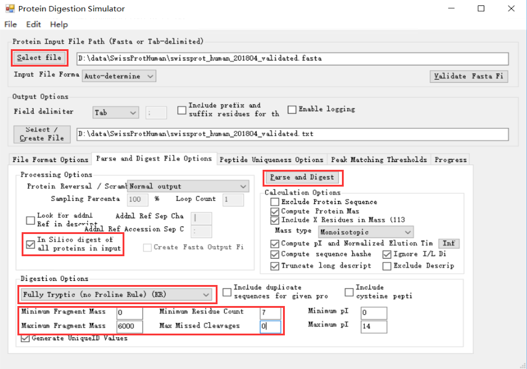

# DeepDIA Demo: Spectral Library Generation From Proteome Databases
Using deep learning to generate in silico spectral libraries from proteome databases for data-independent acquisition (DIA) analysis. 

## 1. System Requirements
In this demo, spectral library generation has been tested on a workstation with Intel Xeon E5-2690 v3 CPU, 16 GB RAM, and Microsoft Windows Server 2016 Version 1607 (OS Build 14393.2430) operating system with the following softwares:
- Anaconda 4.2.0 (Python 3.5.2).
- Keras 2.2.4 and TensorFlow 1.11.
- Microsoft R Open 3.5.1.
- RStudio 1.1.447.
- R pakages `rjson` and `readr`.
- Protein Digestion Simulator (https://omics.pnl.gov/software/protein-digestion-simulator).

DIA data analysis is performed on a workstation with Intel Core i9-7960X CPU, 128 GB RAM, and Microsoft Windows 10 Version 1809 (OS Build 17763.503) 64-bit operating system with the following softwares:
- Spectronaut 12.0.20491.

## 2. Demo Data
LC-MS/MS data of 3 DIA technical replicates of 2 h gradient of HeLa cells on Q Exactive HF are available at ProteomeXchange (http://proteomecentral.proteomexchange.org/) with the data set `PXD005573`. (Bruderer, R. et al. Mol. Cell. Proteomics 2017, 16, 2296-2309.)
- Fig1_MP-DIA-120min120kMS1-22W30k-8dppp_MHRM_R01.raw
- Fig1_MP-DIA-120min120kMS1-22W30k-8dppp_MHRM_R02.raw
- Fig1_MP-DIA-120min120kMS1-22W30k-8dppp_MHRM_R03.raw

SwissProt *Homo sapiens* database (2018-04 version, 20,301 entries), pre-trained models, and in silico spectral libraries are available at ProteomeXchange/iProX with identifier `PXD014108/IPX0001628000`.
- swissprot_human_201804_validated.fasta

Pre-trained models for Q Exactive HF trained with HeLa data from `PXD005573` are available at ProteomeXchange/iProX with identifier `PXD014108/IPX0001628000`.
- HeLa.model.zip

They are also provided in `data/models` folder.

Generated spectral libraries and the saved projects from Spectronaut are also available at ProteomeXchange/iProX with identifier `PXD014108/IPX0001628000`.
- SwissProtHuman_prediction.library.zip
- SwissProtHuman_prediction.kit
- HeLa_SwissProtHuman_prediction.sne.z01
- HeLa_SwissProtHuman_prediction.sne.zip
- HeLa_SwissProtHuman_prediction.csv.zip

## 3. Spectral Library Generation
### 3.1. Prepare a Peptide List
A peptide list can been generated by in silico digestion from protein sequences (FASTA). Protein digestion can be performed using Protein Digestion Simulator.

Tryptic (no Proline Rule) and Tryptic are selected as digestion enzyme, respectively. Digestion is performed with the following parameters:
- Max Miss Cleavages: 0
- Minimum Residue Count: 7
- Maximun Fragment Mass: 6000
- Minimun Fragment Mass: 0



After each digestion, Rename the output file to avoid overwriting.
```
mv swissprot_human_201804_validated_digested_Mass0to6000.txt swissprot_human_201804_validated_digested_TrypsinP.txt

mv swissprot_human_201804_validated_digested_Mass0to6000.txt swissprot_human_201804_validated_digested_Trypsin.txt
```

DeepDIA only supports peptide sequences with standard amino acids (ACDEFGHIKLMNPQRSTVWY) and length <= 50.

Start RStudio, ensure package `readr` has been installed.
```
install.packages("readr")
```

Set the peptide list directory as working directory and run `extract_peptides_from_ProteinDigestionSimulator_result.R`.
```
setwd("{PATH_TO_DATA}")
source("{PATH_TO_CODE}/extract_peptides_from_ProteinDigestionSimulator_result.R")
```

The peptide list file is generated in the working directory.
- swissprot_human_201804_validated.peptide.csv


### 3.2. Generate Spectral Library
Follow the instruction described in *DeepDIA Demo: Spectral Library Generation From Peptide Lists* to predict MS/MS spectra and iRT, and generate a spectral library.

Expected run time depends on the number of peptides and the performance of the computer. In this demo, this command may take up to 1 day.

An entrapment strategy has been used to evaluate identification error rates by adding proteins from other organisms to the libraries. The entrapment protein sequence databases and in silico spectral libraries are available at ProteomeXchange/iProX with identifier `PXD014108/IPX0001628000`.
- swissprot_Caenorhabditis_elegans_201903.fasta
- swissprot_Dictyostelium_discoideum_201903.fasta
- swissprot_Escherichia_coli_strain_K12_201903.fasta
- swissprot_Saccharomyces_cerevisiae_strain_ATCC_204508_S288c_201903.fasta
- SwissProt_entrapment_prediction.library.zip
- SwissProt_entrapment_prediction.kit.zip


## 4. DIA Analysis
DIA analysis can be performed following the instruction described in *DeepDIA Demo: Spectral Library Generation From Peptide Lists*.

For DIA analysis using large spectral libraries, `Machine Learning` is set to `Across Experiment`.

```
Settings Used: BGS Factory Settings   
   └─ Identification  
      └─ Machine Learning:	Across Experiment   
```

For benchmarking purpose, the saved projects using a sample-specific spectral library generated by data-dependent acquisition (DDA) experiments, and directDIA are also available at ProteomeXchange/iProX with identifier `PXD014108/IPX0001628000`.
- HeLa_DDA.kit
- HeLa_DDALib.sne.zip
- HeLa_DDALib.csv.zip
- HeLa_SwissProtHuman_directDIA.sne.zip
- HeLa_SwissProtHuman_directDIA.csv.zip
