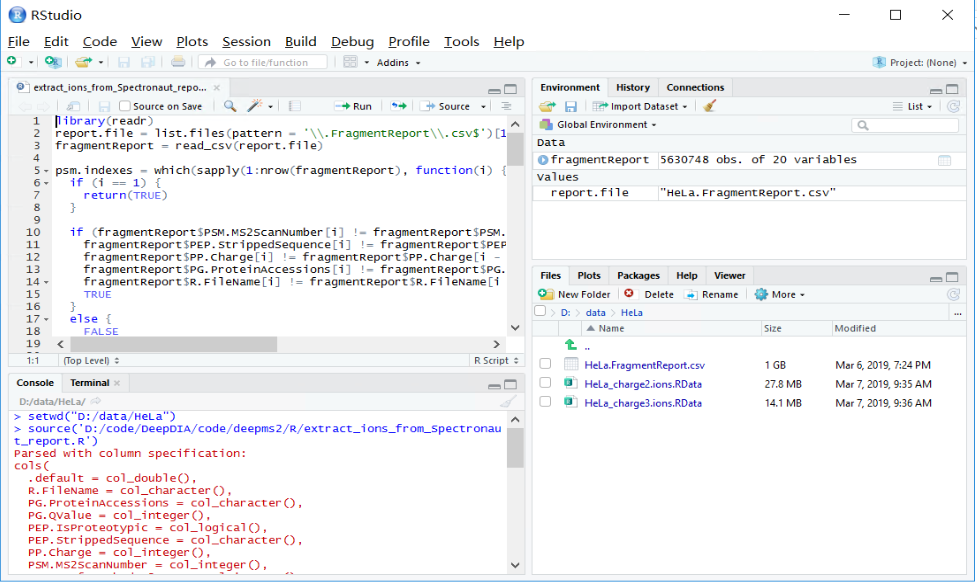
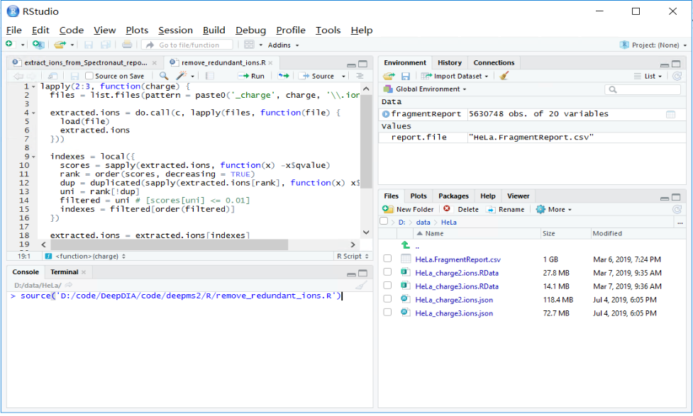
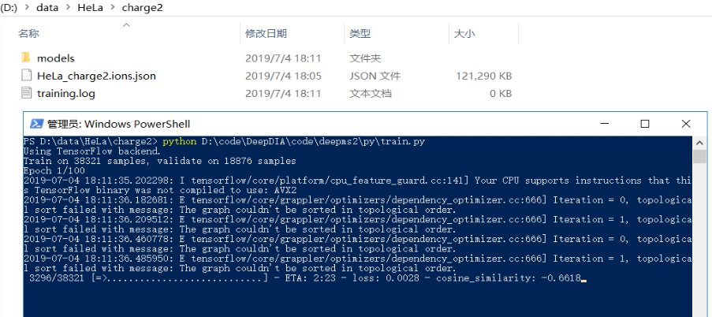
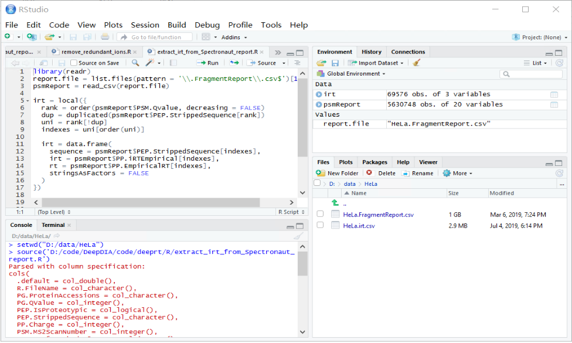
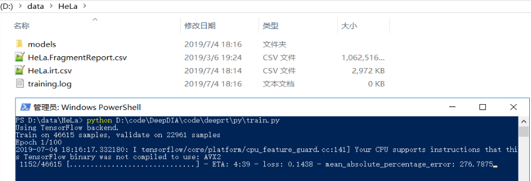

# DeepDIA Demo: Training New Models for MS/MS and iRT Prediction
Training new models for MS/MS and iRT prediction using data-dependent acquisition (DDA) data.

## 1. System Requirements
This demo has been tested on a workstation with Intel Xeon E5-2690 v3 CPU, 16 GB RAM, and Microsoft Windows Server 2016 Version 1607 (OS Build 14393.2430) operating system with the following softwares:
- Anaconda 4.2.0 (Python 3.5.2).
- Keras 2.2.4 and TensorFlow 1.11.
- Microsoft R Open 3.5.1.
- RStudio 1.1.447.

A GPU card with Compute Unified Device Architecture (CUDA) is recommended, e.g. NVIDIA GeForce GTX 1050 Ti.

## 2. Demo Data
LC-MS/MS DDA data of HeLa cells on Q Exactive HF are available at ProteomeXchange (http://proteomecentral.proteomexchange.org/) with the data set `PXD005573`. (Bruderer, R. et al. Mol. Cell. Proteomics 2017, 16, 2296-2309.)
- C_D160304_S251-Hela-2ug-2h_MSG_R01_T0.raw
- C_D160304_S251-Hela-2ug-2h_MSG_R02_T0.raw
- C_D160304_S251-Hela-2ug-2h_MSG_R03_T0.raw
- C_D160331_S209-HPRP-HeLa-05_MSG_R01_T0.raw
- C_D160331_S209-HPRP-HeLa-10_MSG_R01_T0.raw
- C_D160331_S209-HPRP-HeLa-15_MSG_R01_T0.raw
- C_D160331_S209-HPRP-HeLa-20_MSG_R01_T0.raw
- C_D160331_S209-HPRP-HeLa-25_MSG_R01_T0.raw
- C_D160331_S209-HPRP-HeLa-50_MSG_R01_T0.raw
- C_D160331_S209-HPRP-HeLa-FT_MSG_R01_T0.raw
- C_D160401_S209-HPRP-HeLa-05_MSG_R01_T0.raw
- C_D160401_S209-HPRP-HeLa-10_MSG_R01_T0.raw
- C_D160401_S209-HPRP-HeLa-15_MSG_R01_T0.raw
- C_D160401_S209-HPRP-HeLa-20_MSG_R01_T0.raw
- C_D160401_S209-HPRP-HeLa-25_MSG_R01_T0.raw
- C_D160401_S209-HPRP-HeLa-50_MSG_R01_T0.raw
- C_D160401_S209-HPRP-HeLa-FT_MSG_R01_T0.raw

SwissProt *Homo sapiens* database (FASTA) can be downloaded from UniProt (https://www.uniprot.org/). The FASTA file (2018-04 version, 20,301 entries)
has been deposited to ProteomeXchange via the iProX partner repository with the data set identifier `PXD014108/IPX0001628000`. 
- swissprot_human_201804_validated.fasta

The saved project and exported results from SpectroMine are also available at ProteomeXchange/iProX with identifier `PXD014108/IPX0001628000`.
- HeLa_DDA.psar.zip
- HeLa_DDA.csv.zip

## 3. Prepare Training Data
Training data can be converted from SpectroMine fragment reports (CSV). As an alternative, MaxQuant results (`msms.txt`) are also supported.

In this demo, SpectroMine reports are used, which should be exported with the schema provided in the `misc/SpectroMine_Report_Schema` folder.
- FragmentReport.rs

The file name of fragment report should end with `.FragmentReport.csv`, e.g. `HeLa.FragmentReport.csv`.

SpectroMine Manual is available at https://biognosys.com/shop/spectromine.

## 4. Train a MS/MS Model
Prepare an ions file for MS/MS prediction. An ions file can be converted from a SpectroMine fragment report.

Start RStudio, ensure packages `readr` and `rjson` have been installed.
```
install.packages("readr")
install.packages("rjson")
```

Set the working directory to the fragment report.
```
setwd("{PATH_TO_DATA}")
```

Open `deepms2/R/extract_ions_from_Spectronaut_report.R` and run the script by clicking `Source`.
```
source("{PATH_TO_CODE}/deepms2/R/extract_ions_from_Spectronaut_report.R")
```

We get two output ions files. 
- HeLa_charge2.ions.RData
- HeLa_charge3.ions.RData



Run `deepms2/R/remove_redundant_ions.R` to get a unique MS/MS spectrum for each peptide.

We get two output ions files. 
- HeLa_charge2.ions.json
- HeLa_charge3.ions.json



Move them into saperate folders `charge2` and `charge3`
```
mkdir charge2
mv HeLa_charge2.ions.json charge2
mkdir charge3
mv HeLa_charge3.ions.json charge3
```

Run `deepms2/py/train.py` in the `charge2` directory.
```
cd charge2
python {PATH_TO_CODE}/deepms2/py/train.py
```

Expected run time depends on the number of peptide spectra and the performance of the computer. In this demo, this command may take several hours to a day.

In the `models` folder, we find the trained model (with checkpoints during training) for charge 2+ peptides.



Train the model for charge 3+ following the same steps.

## 5. Train an iRT Model
Prepare an iRT file for iRT prediction.
An iRT file can be converted from a SpectroMine fragment report.

Start RStudio and set the working directory to the fragment report.
```
setwd("{PATH_TO_DATA}")
```

Open `deeprt/R/extract_irt_from_Spectronaut_report.R` and run the script by clicking `Source`.
```
source("{PATH_TO_CODE}/deeprt/R/extract_irt_from_Spectronaut_report.R")
```

We get the output iRT file. 
- HeLa_charge2.irt.csv



Run `deeprt/py/train.py`.
```
python {PATH_TO_CODE}/deeprt/py/train.py
```

Expected run time depends on the number of peptide spectra and the performance of the computer. In this demo, this command may take several hours to a day.



In the `models` folder, we find the trained model (with checkpoints during training).

